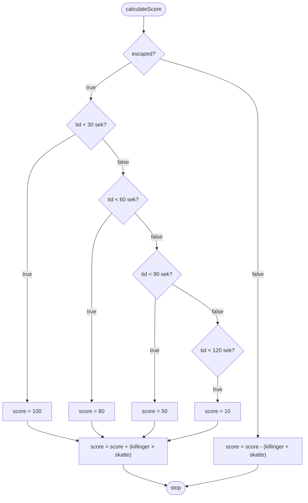

# Øvelse: Labyrint-algoritmen

## Scenariet

Du spiller et spil hvor du skal nå igennem en labyrint på under 2 minutter og 30 sekunder. Undervejs kan du samle skatte op og redde killinger. Når tiden er udløbet beregner en algoritme din score.

**Opgaven er at kode denne algoritme.**

---

## Hvilke variable har vi brug for?

Algoritmen skal bruge følgende information for at beregne scoren. Erklær en variabel til hver:

| Variabel | Type | Beskrivelse |
|----------|------|-------------|
| Er spilleren nået ud? | `boolean` | sand hvis spilleren nåede ud af labyrinten |
| Tid brugt | `int` | antal sekunder spilleren brugte |
| Antal skatte | `int` | antal skatte samlet undervejs |
| Antal killinger | `int` | antal killinger reddet undervejs |
| Score | `int` | beregnes af algoritmen — start med 0 |

---

## Sådan beregnes scoren

Algoritmen følger to forskellige spor afhængig af om spilleren nåede ud:

### Hvis spilleren *ikke* nåede ud

Scoren straffes: **træk antallet af killinger plus antallet af skatte fra scoren.**

### Hvis spilleren *nåede ud*

**Trin 1 — giv en grundscore baseret på tid:**

| Tid | Grundscore |
|-----|------------|
| Under 30 sekunder | 100 point |
| Under 60 sekunder | 80 point |
| Under 90 sekunder | 50 point |
| Under 120 sekunder | 10 point |

**Trin 2 — læg bonus til:**  
Læg `antal killinger × antal skatte` til scoren.

---

## Kig på diagrammet

Flowdiagrammet herunder viser algoritmen visuelt. Brug det til at tjekke at din forståelse af reglerne stemmer overens med diagrammet — inden du begynder at kode.

---

## Nu koder du det

1. Erklær variablerne og giv dem testværdier
2. Implementér algoritmen med betingelser
3. Udskriv den beregnede score med `println()`

Test din kode med mindst disse tre scenarier:

| Scenarie | escaped | tid | skatte | killinger | Forventet score |
|----------|---------|-----|--------|-----------|-----------------|
| Hurtig helt | true | 25 | 3 | 2 | 106 |
| Langsom | true | 95 | 1 | 1 | 11 |
| Nåede ikke ud | false | 150 | 2 | 3 | -5 |