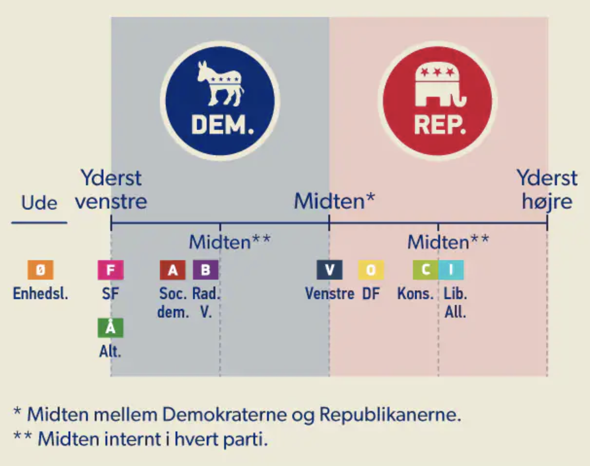

# Den gennemgående opgave

## Hvad er opgaven?

Opgaven går ud på at skabe dette billede i Processing. Det kan laves på mange måder, afhængig af hvad du har i din værktøjskasse.

Herunder har vi ordnet nogle forslag til hvad du hver uge kan gøre for at udvide eller forbedre din kode.

---

## Uge 1

### Intro til Processing

Allerede efter første lektion vil du være i stand til at tegne de grundlæggende elementer: de to farvede baggrundszoner (blå og rød), den vandrette linje der repræsenterer spektret, og de farvede firkanter der markerer hvert parti.
Når du placerer elementerne, træner du din forståelse af Processings tegnefunktioner, deres parametre, og hvordan de påvirker placeringen af primitive shapes i Processing-vinduet.
- Hvert parti har en position på spektret og en farve. Hvordan holder du styr på det?
- Hvad med teksten til partiernes navne?
  [Brug the Processing reference!](https://processing.org/reference/text_.html)
-  Hvad med billeder?
   [Brug the Processing reference!](https://processing.org/reference/loadImage_.html)

## Uge 2

### Variable

Hvad har vi af data i billedet? Hvilke variable skal du lave for at holde på den data? Et par eksempler:

- Linjen har en start- og slutposition — og en y-koordinat. Hvad skal de hedde?
- Nu hvor du har lært om lister som noget der kan holde en bestemt datatype — hvad så med at tilføje en liste med partiernes navne ?

---

## Uge 3

### Betingelser

- Er der noget i billedet der varierer systematisk afhængig af placering på spektret?
- Kan du skrive en betingelse der afgør om et parti hører til venstre eller højre for midten — og fx ændrer tekstfarve eller baggrund derefter?

## Uge 4

### Loops

Er der kommandoer der bliver gentaget mange gange? (mere end 1 betyder "mange" i programmering).

- Analyser hvad der konkret sker for hvert parti: hvad er ens, hvad varierer?
- Er dét der sker betinget af noget — fx partiets position?
- Hvornår skal løkken stoppe?

Ofte er det en god idé at skrive pseudokode når man skal bygge denne slags strukturer.

---

## Uge 5

### Funktioner

Hvor meget gentager du dig selv? Er din kode læselig?

- Kan du samle kommandoerne til at tegne ét parti i en funktion og kalde den i stedet?
  En lang liste af kommandoer er svær at læse. Koden bliver mere overskuelig hvis den er brudt op i mindre bidder.
  Modulariteten giver dig også mulighed for at genbruge kode. Hvis du opdager at du bygger funktioner der ligner hinanden bortset fra en enkelt detalje — overvej om du kan nøjes med én funktion med parametre.

## Uge 6

### Objekter og klasser

Hvilke objekter er der i dette billede?

Du ser måske at der er **grupper** (blok af partier) bestående af **partier**.

- Start to nye klasser: `Group` og `Party`
- Beskriv de to ting i almindelig tekst inden du skriver klasserne
- Hvad er forholdet mellem de to klasser?
- Hvilke felter skal de hver især have?
- Kan du give `Party` en metode der sørger for at tegne partiet på skærmen?
- Hvorfra vil du instantiere `Party` og `Group`?

---

## Uge 7

### Data
Overvej hvad i din kode der kunne leve udenfor koden. Prøv om du kan loade navnene på partierne fra en csv fil.

---

## Jeg har gjort det hele, men der er stadig masser af tid — hvad så?

Er du der hvor du har overvejet alle spørgsmålene ovenfor, ser din kode sandsynligvis ret fornuftig ud nu.

Du kan fortsætte med at fylde på med features og lækkerier. Her er et par ideer:

- Kan du gøre partierne klikbare, så der vises mere info når man klikker?
- Kan du animere et parti der glider hen over spektret?
- Kan du hente partidata fra en fil i stedet for at hardkode det?
- Kan du genbruge strukturen til at visualisere noget helt andet — fx holdninger i en meningsmåling eller karakterer i en klasse?

Vær kreativ — der er ingen regler.